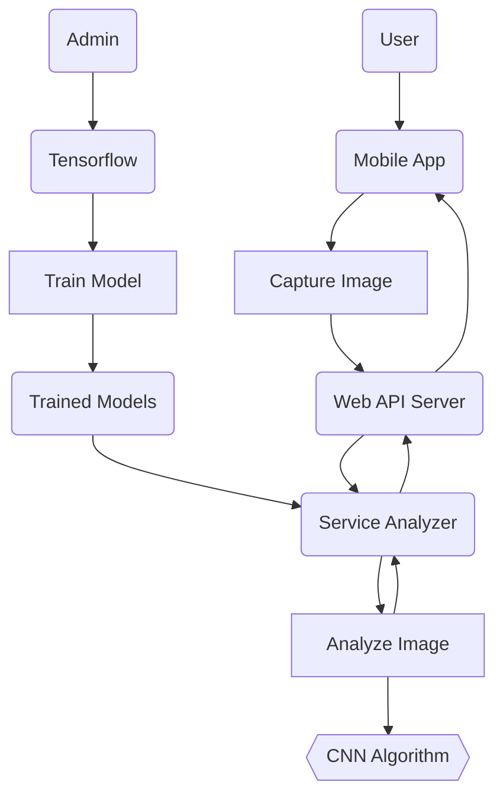

# e-Mango

A Philippine Super Mango Quality and Disease Identification and Prevention using Convolutional Neural Networks Algorithm

## System Flow Chart of Proposed Methodology

## Technologies Stack

1. [Flutter](https://flutter.dev/) for mobile development
2. [Tensorflow](https://www.tensorflow.org/) for machine learning
3. [.NET](https://dotnet.microsoft.com/en-us/) for web api and service analyzer
